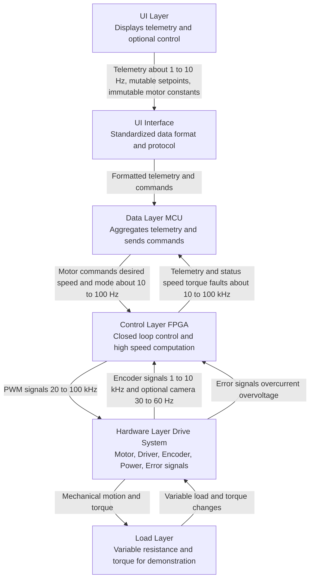

---

# **Project Kickoff Summary: FPGA-Based Adaptive Motor Control Demo**

## **Problem Statement**

In a prior project involving large electromechanical gantry systems, we observed inconsistent motion performance across units. Mechanical tolerances and variability in belt/ball-screw assemblies caused each motor to experience different resistances, leading to stalls or suboptimal speed when executing the same motion profile. Manual tuning of belt tension was unreliable, making consistent high-speed motion difficult to achieve across multiple units. The challenge is to demonstrate a method to maintain consistent motor performance under varying mechanical resistance.

---

## **Proposed Solution**

We propose building a bench-top adaptive motor control demonstrator that simulates dynamic mechanical resistance and illustrates real-time compensation using an FPGA + MCU system.

**Key Elements:**

The FPGA performs deterministic, high-frequency closed-loop control, including:
  * Reading encoder or visual feedback to measure motor position and speed.
  * Estimating torque or load from current sensing or back-EMF.
  * Running a high-frequency PID loop and optional adaptive gain control.

The MCU supervises the system:
  * Sends target speeds and profiles.
  * Logs telemetry for analysis.
  * Provides user interface for tuning and monitoring.

**Advantages Over Alternatives:**

* MCU-only solutions cannot process high-rate sensor data with minimal jitter, limiting deterministic control at high speeds.
* Using an FPGA enables parallel, pixel- or sample-level processing, allowing real-time torque/load estimation and immediate compensation for resistance changes.
* The combined FPGA + MCU system mirrors industrial hybrid architectures, separating high-speed hardware tasks from supervisory software tasks.

**Why This Solves the Problem:**

* High-frequency, deterministic control ensures consistent motor speed despite variable resistance.
* Real-time load estimation allows the system to automatically adjust drive signals, preventing stalls.
* Adaptive control logic simulates scalable solutions for multiple units, addressing the variability observed in the original gantry system.

**Tool and Technology Justification:**

* FPGA is required to handle high-rate, deterministic control and real-time sensor processing.
* MCU provides flexibility for command, logging, and UI functions without overloading FPGA resources.
* Low-cost components allow demonstration of principles without building a full-scale system.

---

## **High-Level Work Breakdown and Milestones**

| Work Package                  | Description                                                                                                     | Rough Time Estimate | Milestone                                                         |
| ----------------------------- | --------------------------------------------------------------------------------------------------------------- | ------------------- | ----------------------------------------------------------------- |
| System Design & Planning      | Define hardware components, control loop strategy, communication protocol between FPGA and MCU                  | 1 week              | Approved design plan                                              |
| Hardware Setup                | Assemble motor, encoder, driver, FPGA, and MCU on bench-top test rig; implement adjustable resistance mechanism | 1 week              | Functional bench-top assembly                                     |
| FPGA Development              | Implement deterministic PID loop, sensor readout, torque/load estimation, adaptive control logic                | 2–3 weeks           | FPGA loop successfully drives motor under static conditions       |
| MCU Development               | Implement supervisory control, target profile commands, telemetry logging, basic UI                             | 1–2 weeks           | MCU can send commands and log data                                |
| Integration & Testing         | Validate FPGA + MCU communication, adaptive response under varying mechanical resistance                        | 1–2 weeks           | System maintains target speed under dynamic resistance variations |
| Demonstration & Documentation | Prepare plots, compare performance (fixed PWM vs FPGA loop), create technical documentation and presentation    | 1 week              | Complete demo ready for presentation                              |

**Total estimated duration:** 6–9 weeks (adjustable depending on team size and parallel work)

---

# **Additional Details Useful for Kickoff**

* Safety considerations for small motor bench-top rig (voltage, moving parts).
* Cost and procurement plan for low-cost FPGA boards, MCUs, motor drivers, sensors.
* Bench-top setup design sketches or reference images.
* Preliminary performance goals (target motor speed, resistance ranges, loop frequency).
* Optional telemetry or visualization approach (PC plots, serial dashboard).

---

# **Block Diagram (Text-Based)**

```
+----------------+           +----------------+           +----------------+
| Target Profile |  Command  | MCU / Host     |  Registers | FPGA           |
| & UI           | --------> | Supervisory    | <--------> | Control Logic  |
|                |           | Control        |           | - Sensor Read  |
+----------------+           +----------------+           | - Torque/Load  |
                                                           | - PID / Adaptive|
                                                           | - PWM Output   |
                                                           +----------------+
                                                                    |
                                                                    v
                                                           +----------------+
                                                           | Motor Driver   |
                                                           +----------------+
                                                                    |
                                                                    v
                                                           +----------------+
                                                           | Motor + Load   |
                                                           +----------------+
                                                                    ^
                                                                    |
                                                           +----------------+
                                                           | Encoder / Sensor|
                                                           +----------------+
```

---

# **Recommended Priority List for Build**

1. Assemble bench-top rig: motor, encoder, driver, FPGA, MCU, adjustable resistance mechanism.
2. Implement basic FPGA PID loop driving motor with static target.
3. Integrate encoder feedback and verify accurate position/speed measurement.
4. Implement MCU interface to send commands and read telemetry.
5. Add torque/load estimation or adaptive gain logic on FPGA.
6. Test system under varying resistance and compare performance (fixed PWM vs FPGA loop).
7. Add optional visualizations (plots, dashboard) for demo.

---


## Benchtop Rig Design

# **Explanation of the Signal Flow**

1. **User Interface (UI):**
    
    - Sends high-level commands (target speed, position, motion profiles) to the MCU.
        
    - Allows live tuning of parameters for adaptive control.
    - Set target speed or position
    - Start/ stop motion
    - Monitor
	    - Motor speed
	    - torque / load
	    - PWM duty cycle
	    - Friction / resistance level
	- Record and plot data in real-time
        
2. **MCU (Supervisory Control):**
    
    - Converts high-level commands to target references for the FPGA.
        
    - Logs motor telemetry (speed, torque, PWM duty cycle) for analysis.
        
    - Adjusts FPGA control parameters in real time if needed.
        
3. **FPGA (High-Speed Deterministic Control):**
    
    - Reads position/speed sensor signals at high frequency.
        
    - Estimates torque/load based on sensor inputs (e.g., current or back-EMF).
        
    - Runs PID/adaptive control loop to determine PWM output.
        
    - Sends PWM signals to the motor driver.
        
4. **Motor Driver:**
    
    - Converts FPGA PWM output to voltage/current suitable for motor.
        
    - Provides isolation/protection if necessary.
        
5. **Motor:**
    
    - Drives wheel or test load.
        
    - Adjustable load simulates different mechanical resistance profiles.
        
6. **Position/Speed Sensor:**
    
    - Provides real-time feedback to FPGA.
        
    - Could be an encoder, optical sensor, or camera-based system.


Perfect. Here’s a **modular, model-agnostic block diagram** showing how the **UI, MCU, and FPGA interact**, keeping future upgrades in mind. The goal is to make the system **decoupled, flexible, and future-proof**.

---

# **Modular UI + MCU + FPGA Block Diagram**

```
          +--------------------------+
          |   User Interface (UI)    |
          |--------------------------|
          | Options:                 |
          | - PC GUI (Python, etc.) |
          | - Web dashboard (future)|
          | - Embedded OLED/buttons |
          +------------+-------------+
                       |
                 Standardized Command / Telemetry Protocol
                       |
                       v
          +--------------------------+
          |          MCU             |
          |--------------------------|
          | - Sends target speed/position commands to FPGA      |
          | - Writes PID/adaptive parameters to FPGA registers  |
          | - Reads telemetry (speed, torque/load, PWM)        |
          | - Exposes telemetry/commands to UI via serial/WiFi |
          | - Optional data logging                                |
          +------------+-------------+
                       |
          Standardized FPGA Register Interface (SPI/I²C/UART)
                       |
                       v
          +--------------------------+
          |          FPGA            |
          |--------------------------|
          | High-Frequency Real-Time Control:                    |
          | - Sensor input (encoder, optional camera/vision)   |
          | - Torque/load estimation (current/back-EMF)       |
          | - PID/adaptive loop                                  |
          | - PWM output to motor driver                         |
          +------------+-------------+
                       |
                       v
          +--------------------------+
          |      Motor Driver        |
          +------------+-------------+
                       |
                       v
          +--------------------------+
          |         Motor            |
          | - Adjustable load/friction|
          +------------+-------------+
                       ^
                       |
          +--------------------------+
          |  Position/Speed Sensor   |
          | (Encoder / Optional Camera)|
          +--------------------------+
```

---

# **Design Notes**

1. **UI Layer**

   * Decoupled from FPGA/MCU implementation.
   * Can be swapped later (PC GUI → Web dashboard → Embedded OLED/buttons) without modifying MCU core logic.

2. **MCU Layer**

   * Acts as a **bridge** between FPGA registers and user interface.
   * Exposes telemetry and receives commands in a **standardized protocol**.
   * Can log or stream data independently of the FPGA loop.
   * Rule of Thumb: If your task is time-critical, interacts with hardware in real-time, and doesn’t require a full OS → MCU. If your task is compute-heavy, requires multitasking, complex networking, or a full OS → MPU.

3. **FPGA Layer**

   * Handles **time-critical, deterministic functions**:

     * Sensor acquisition
     * PID/adaptive control
     * PWM output
   * Completely independent from UI technology.
   * Communication is strictly through registers or command/telemetry packets.

1. [[Motor + Sensor Layer]]

   * Simulates the mechanical system with adjustable load.
   * Sensor feedback feeds into FPGA for high-speed control.

In my own words:

- UI Layer (not important right now) 
	- Purpose: Displays telemetry, allows monitoring (and eventually, maybe control parameters).
	- Current status: Not important for now; can be a placeholder or simple serial/terminal interface.
	- Future: Can upgrade to a PC GUI, web interface, or tablet app.
	- Takeaway: Low priority now. Focus on feeding data to this layer rather than designing it.
- UI Interface ( some standardized interface for data to be represented by the UI Layer) 
	- Purpose: Standardized data channel from MCU → UI Layer.
	- Format: Could be JSON over UART/USB, SPI, CAN messages, or simple structs for now.
	- Role: Ensures any future UI upgrade can just read from this interface without redesigning control logic.
	- Takeaway: Keep interface abstract and modular. Decide on format later. Just ensure MCU exposes telemetry cleanly.
- Data Layer (MCU - handles data I/o) 
	- Purpose:
		- Receives telemetry from FPGA (motor speed, torque, encoder position, fault flags).
		- Optionally sends commands back to FPGA (e.g., desired speed, mode switches).
		- Handles communication with UI Layer.
	- Inputs: FPGA data, user commands.
	- Outputs: Telemetry to UI Layer, control signals to FPGA.
	- Mutable vs immutable:
		- Mutable: motor setpoints, operating mode, maybe loop parameters.
		- Immutable: FPGA-reported parameters like encoder resolution, motor constants.
	- Takeaway: MCU acts as a translator and telemetry aggregator — no heavy computation here.
- Control Layer (FPGA - controls the closed-loop feedback system for the BLDC and relays data to the MCU) 
	- Purpose: Implements the closed-loop control (BLDC FOC or similar) at high speed.
	- Inputs: Encoder signals (quadrature or other), optional error signals, motor commands from MCU.
	- Outputs: PWM drive signals, feedback to MCU, status/error flags.
	- Key points:
		- Must meet timing requirements dictated by motor + encoder (loop frequency).
		- Performs adaptive control, not the UI logic.
		- FPGA is ideal for parallel, deterministic computation, especially for high-frequency loops.
	- Takeaway: This is the heart of your project and where the FPGA provides value over a simple MCU.
- Hardware Layer (Drive System - Motor, Encoder, Power delivery, Error signals, Driver) 
	- Purpose: Physical BLDC system that converts FPGA commands into torque/motion.
	- Components:
		- Motor
		- Driver / ESC / gate driver
		- Encoder or feedback sensor
		- Power delivery (DC supply, possibly current limiting)
		- Error signal lines (overcurrent, overvoltage, thermal flags)
	- Interaction: FPGA generates PWM and monitors feedback. MCU reads status and relays to UI.
	- Takeaway: Choose components compatible with your loop frequency and voltage/current limits. For bench-top, keep voltages safe (<24 V) and currents moderate.
- Load Layer (Interacts with the drive system to allow for dynamic variability in the motor performance)
	- Purpose: Provides variable resistance or torque so your adaptive loop has something to respond to.
	- Examples:
		- A spring-loaded flywheel
		- Variable brake or friction system
		- Small mechanical load (weights, magnetic brake)
	- Role: This is where you can demonstrate the FPGA’s adaptive control capabilities without building a full mechanical robot.
	- Takeaway: Focus on something simple that adds measurable variability. Even a small flywheel with a friction brake can create enough load change for your demo.



Perfect. Here’s a **high-level firmware development plan** for both FPGA and MCU, broken into **feature blocks, tasks, and rough milestones**. This is meant for a bench-top prototype and aligns with your layered architecture.

---

## **1. FPGA Firmware Development Plan**

| Feature / Module                 | Tasks                                                                                                     | Rough Milestone / Time Estimate |
| -------------------------------- | --------------------------------------------------------------------------------------------------------- | ------------------------------- |
| **Motor Control Loop (FOC)**     | - Implement PWM generation<br>- Implement feedback loop (encoder-based)<br>- Tune loop gains              | 2–3 weeks                       |
| **Sensor Interface**             | - Connect encoder inputs<br>- Implement optional camera interface<br>- Filter signals                     | 1–2 weeks                       |
| **Telemetry & Status Reporting** | - Package speed, torque, fault status<br>- Send to MCU via protocol (SPI/UART)                            | 1 week                          |
| **Adaptive Load Compensation**   | - Adjust PWM/loop gains in real-time based on load changes<br>- Implement test routines for variable load | 1–2 weeks                       |
| **Safety & Fault Handling**      | - Monitor error signals<br>- Implement immediate stop / limit functions                                   | 1 week                          |
| **Optional Logging / FIFO**      | - Implement small telemetry buffer for debugging<br>- Provide simple readout via MCU                      | 0.5–1 week                      |

**Total Estimated FPGA Development Time:** ~6–9 weeks (parallel tasks can shorten duration)

---

## **2. MCU Firmware Development Plan**

| Feature / Module                   | Tasks                                                                                                | Rough Milestone / Time Estimate |
| ---------------------------------- | ---------------------------------------------------------------------------------------------------- | ------------------------------- |
| **FPGA Communication Interface**   | - Implement SPI/UART/CAN interface<br>- Receive telemetry<br>- Send commands to FPGA                 | 1–2 weeks                       |
| **Data Aggregation & Formatting**  | - Convert raw FPGA data into standard telemetry format<br>- Apply filtering / averaging              | 1 week                          |
| **UI / Telemetry Interface**       | - Provide serial / USB / CAN output for display<br>- Accept user commands (setpoints, mode switches) | 1 week                          |
| **Configuration Management**       | - Store mutable parameters (setpoints, operating modes)<br>- Provide defaults for start-up           | 0.5 week                        |
| **Optional Logging / Diagnostics** | - Implement telemetry buffering for analysis<br>- Report errors/warnings to UI                       | 0.5–1 week                      |

**Total Estimated MCU Development Time:** ~3–4 weeks

---

## **3. Suggested Development Milestones / Gait**

1. **Milestone 1 – Bench-top Communication Test**

   * FPGA generates PWM at safe fixed frequency.
   * MCU receives dummy telemetry and sends simple commands.
   * **Goal:** Confirm FPGA↔MCU interface works.

2. **Milestone 2 – Encoder Feedback Loop**

   * FPGA reads encoder and implements closed-loop PWM control.
   * Test with fixed load (no adaptive gain).
   * **Goal:** Motor follows setpoints with basic control.

3. **Milestone 3 – Adaptive Load Compensation**

   * Implement real-time gain adjustment / PWM adaptation on FPGA.
   * Apply variable load using simple friction or flywheel.
   * **Goal:** Motor maintains speed/torque under changing load.

4. **Milestone 4 – Telemetry & UI Integration**

   * MCU collects telemetry from FPGA.
   * Send data to placeholder UI (terminal or simple GUI).
   * **Goal:** User can monitor motor state and see adaptive compensation in action.

5. **Milestone 5 – Safety & Fault Handling**

   * Implement FPGA immediate response to errors.
   * MCU reports errors to UI.
   * **Goal:** System stops safely under fault conditions.

6. **Milestone 6 – Optional Enhancements**

   * Camera-based feedback mode toggle.
   * Logging / advanced telemetry.
   * UI improvements (PC GUI / web).

---

**Notes:**

* Milestones are sequential but some tasks can be parallelized.
* FPGA firmware takes priority due to **deterministic control requirements**.
* MCU firmware can evolve incrementally, starting with minimal telemetry.
* Safety and fault handling should be integrated early as part of loop tests.


---

# **Priority List for Development**

1. **Motor + Sensor + Driver**: Verify mechanical setup and sensor readout.
2. **FPGA Basic PID Loop**: Implement and test closed-loop control on motor.
3. **MCU-FPGA Interface**: Standardize registers for target, telemetry, and parameters.
4. **Simple PC GUI**: Connect to MCU, send commands, read telemetry, and visualize motor behavior.
5. **Adaptive / Load Estimation Logic**: Add torque/load sensing and adaptive control.
6. **Future UI Upgrades**: Web dashboard, OLED/buttons interface.

---

This diagram and design make it **clear to your team** that the UI is modular, the FPGA handles all real-time logic, and the MCU abstracts the communication, making the system **flexible, testable, and future-proof**.

If you want, I can **also produce a similar internal FPGA block diagram** showing how the FPGA modules (sensor readout, PID loop, adaptive logic, PWM generator) are structured, so your team sees the real-time control architecture clearly. This is usually the next step after the high-level setup. Do you want me to do that next?

[[UI Layer]]

Perfect. Let’s lay out a **low-cost, bench-top wiring plan** for your adaptive motor control demo. This will be **component-agnostic**, showing logical connections rather than committing to a specific part number. The goal is to make it **clear how FPGA, MCU, motor, sensors, and power interact**, so you can build it safely and modularly.

---

# **Bench-Top Wiring Plan (Logical Connections)**

```
  +------------------+           +------------------+
  |   User Interface |<--------->|       MCU        |
  |   (PC / optional |  Serial   |  Supervisory     |
  |    future UI)    |           |  Control &       |
  |                  |           |  Telemetry       |
  +------------------+           +------------------+
                                         |
                       Standardized Command / Telemetry Protocol
                                         |
                                         v
                               +------------------+
                               |       FPGA       |
                               | High-Speed       |
                               | Control Loop     |
                               | - Read Sensors   |
                               | - PID/Adaptive   |
                               | - PWM Generation |
                               +------------------+
                                         |
                                    PWM / Control Signals
                                         |
                                         v
                               +------------------+
                               |   Motor Driver   |
                               | - Converts PWM   |
                               |   to motor V/I   |
                               | - Optional current|
                               |   feedback       |
                               +------------------+
                                         |
                                         v
                                   +-------------+
                                   |    Motor    |
                                   | - Load /    |
                                   |   Friction  |
                                   +-------------+
                                         ^
                                         |
                         +------------------------------+
                         | Position / Speed Sensor      |
                         | - Encoder, Hall effect, or  |
                         |   optional camera           |
                         +------------------------------+
```

---

# **Detailed Wiring / Signal List**

### **1. FPGA → Motor Driver**

* **PWM outputs** from FPGA to motor driver input pins.
* Optional **direction signals** if using an H-bridge.
* Optional **enable/fault signals** back to FPGA for protection.

### **2. FPGA → Sensors**

* Quadrature encoder inputs (A/B channels) for position/speed.
* Optional: analog current sensor input for torque/load estimation.
* Optional: camera interface (if used), but could be routed via MCU.

### **3. MCU → FPGA**

* Communication bus for commands and telemetry:

  * SPI, UART, or I²C (choose depending on board capabilities)
  * Commands: target speed, PID gains, adaptive parameters, start/stop
  * Telemetry: speed, torque/load, error, PWM duty cycle
* Optional GPIO for start/stop or safety override.

### **4. MCU → UI / PC**

* Serial over USB (or Wi-Fi / Ethernet for future web UI)
* Transmit telemetry and receive parameter updates from user interface

### **5. Power Connections**

* **Motor:** powered via motor driver (external supply matched to motor voltage/current)
* **FPGA & MCU:** powered via regulated 3.3V / 5V supply (could be shared or separate)
* Ensure **common ground** between MCU, FPGA, motor driver, and sensors.

### **6. Adjustable Load**

* Mechanically applied to motor (friction pad, spring, rubber band)
* No electrical connection unless you add a sensor to measure resistance.

---

# **Practical Notes**

1. **Grounding:** All components (FPGA, MCU, motor driver, sensors) must share a common ground to ensure stable signal levels.
2. **Isolation:** For motors with higher currents, consider opto-isolation between FPGA PWM signals and motor driver.
3. **Modularity:** Use headers/breadboards for FPGA, MCU, and sensor connections so parts can be swapped without rewiring.
4. **Testability:** Start by wiring just FPGA → Motor → Encoder → MCU → UI, then add adaptive load estimation and optional telemetry gradually.

---

Exactly—**timing analysis is critical in embedded systems**, especially when deciding MCU vs FPGA, RTOS vs bare-metal, or even how to structure your control loop. Let’s break this down in a practical, intuitive way.

---

## **1. What is timing analysis?**

Timing analysis answers **how long each part of your system takes to execute** and whether it meets the system requirements.

In your project, the main question is:

> Can the FPGA + MCU + control loop update fast enough to handle changes in motor speed/load reliably?

**Typical steps:**

1. **Define your control loop rate:**

   * E.g., PID loop updates, adaptive gain updates, PWM frequency.
   * Often expressed in Hz or kHz (updates per second).

2. **Measure or estimate execution time:**

   * For MCU: Use timers or cycle counters to measure **how long a firmware loop takes**.
   * For FPGA: Measure logic propagation, clock cycles per loop, or simulation timing (synthesis tools can tell you max frequency).

3. **Compare against system requirements:**

   * Motor dynamics and sensor response define **how fast you need to react**.
   * If your loop is too slow, the system may oscillate or fail to maintain target speed.

---

## **2. How to measure timing**

### **MCU / Firmware**

* **Cycle counters / hardware timers**:

  * Many MCUs have a free-running cycle counter or timer (e.g., SysTick on STM32).
  * Wrap your control loop with `start_timer()` / `stop_timer()` to get elapsed cycles.
* **GPIO toggling / oscilloscope**:

  * Toggle a pin at the start/end of a loop. Observe pulse width with an oscilloscope.
* **Software profiling tools** (less common for small MCUs):

  * Embedded IDEs like STM32CubeIDE can provide cycle counts.

### **FPGA**

* **Simulation timing**:

  * Use simulation tools (ModelSim, Vivado Simulator) to measure signal propagation.
* **Synthesis reports**:

  * FPGA tools give **max achievable clock frequency**.
* **Oscilloscope measurement**:

  * Toggle test signals to measure cycle durations in hardware.

---

## **3. How critical is “100 kHz vs 200 kHz”?**

Depends on **your motor dynamics and sensor resolution**:

* **Example:** Motor with encoder resolution of 1000 pulses/rev, max speed 3000 RPM (~50 rev/sec):

  * 50 rev/sec × 1000 pulses → 50,000 pulses/sec (50 kHz)
  * If your control loop updates at 100 kHz → ~2 updates per pulse → sufficient
  * At 200 kHz → ~4 updates per pulse → slightly more precision, but may not be noticeable in practice.

**Rule of thumb:**

* **Loop frequency should comfortably exceed the fastest system changes**.
* Doubling frequency may improve performance slightly, but past a certain point, **mechanical inertia and sensor noise dominate**, so higher frequency doesn’t yield practical benefits.

---

## **4. Practical tips for your project**

1. **Estimate required loop rate first**:

   * Use encoder resolution, max motor speed, torque dynamics, and friction variability.
2. **Start conservative**:

   * Example: 10× the fastest expected change (Nyquist-like safety margin).
3. **Measure in practice**:

   * Log loop execution times, PWM update intervals, and motor response.
4. **Adjust FPGA or MCU implementation**:

   * FPGA handles high-speed PID loop.
   * MCU handles supervisory tasks; timing here is less critical.

---

### **Bottom line**

* Timing analysis is **both estimation and measurement**.
* Execution rates matter **relative to the system dynamics**, not just absolute Hz/kHz/MHz.
* For your motor control demo: 100–200 kHz FPGA loop is likely sufficient; going higher probably won’t produce noticeable benefits unless your motors or sensors are extremely fast.

---

If you want, I can make a **practical example showing how to calculate the minimum control loop frequency for your motor and encoder setup**, so you can justify your FPGA/MCU timing choices to senior engineers.

Do you want me to do that?

Great! Let’s go through a **practical example for calculating the minimum control loop frequency** for your adaptive motor control demo. We’ll base it on your **bench-top motor + encoder + FPGA control loop** scenario.

---

## **1. Define system parameters**

For this example:

| Parameter                      | Example Value              | Notes                                                            |
| ------------------------------ | -------------------------- | ---------------------------------------------------------------- |
| Motor max speed                | 3000 RPM                   | 50 revolutions/sec                                               |
| Encoder resolution             | 1000 pulses/rev            | Quadrature, gives 4000 counts per rev if counting all edges      |
| Desired control responsiveness | 10× Nyquist margin         | Control loop updates should be ≥ 10× the fastest expected change |
| Motor torque dynamics          | ~50 ms mechanical response | How fast torque actually changes with load                       |

---

## **2. Calculate pulse frequency**

1. **Encoder pulses per second at max speed**:

[
\text{pulses/sec} = \text{RPM} \times \frac{\text{pulses/rev}}{60}
]

[
\text{pulses/sec} = 3000 \times \frac{1000}{60} \approx 50,000 \text{ pulses/sec}
]

> So the motor generates 50 kHz of pulse events at max speed.

2. **Consider quadrature decoding**:

* If counting all edges (4× per pulse), effective pulse events = 200 kHz.

---

## **3. Determine minimum loop frequency**

* **Rule of thumb:** loop frequency should be ≥ 2× fastest signal (Nyquist) for basic stability.
* For **smooth control**, we often use **5–10× the fastest pulse rate** to give the PID enough updates per encoder event.

[
f_\text{loop,min} \approx 5 \times 200~\text{kHz} = 1~\text{MHz} \quad (\text{conservative})
]

> On FPGA, this is easily achievable; most MCUs would struggle with 1 MHz software loop for counting encoder pulses in real time.

* **Practical approach for MCU**: let FPGA handle high-speed pulse counting and PID; MCU polls at lower rate (~1–10 kHz) for telemetry and supervision.

---

## **4. PWM frequency considerations**

* PWM should be at least **10–20× higher than control loop frequency** for smooth actuation.
* Example:

  * Control loop: 100 kHz
  * PWM: 500 kHz (high enough for low-speed torque ripple reduction)

---

## **5. Mechanical response check**

* Motor torque/inertia typically limits how fast system responds.
* If mechanical response is ~50 ms (20 Hz), there’s **no practical benefit to control loops > 100 kHz** for observable performance—but FPGA can still handle it for precise, low-latency feedback.

---

## **6. Summary Table**

| Parameter              | Value       | Notes                                                    |
| ---------------------- | ----------- | -------------------------------------------------------- |
| Encoder max pulse rate | 200 kHz     | Quadrature decoding                                      |
| Desired control loop   | 100–200 kHz | FPGA PID loop; MCU lower for telemetry                   |
| PWM frequency          | 500 kHz     | Smooth motor actuation                                   |
| Mechanical response    | 50 ms       | Loops >100 kHz have negligible effect on observed motion |

**Takeaway:**

* FPGA handles **high-speed, deterministic control** (100–200 kHz) → sufficient for adaptive control.
* MCU handles **supervisory tasks at 1–10 kHz** → fine for telemetry, commands, UI.
* No need to run MPU or full OS for this setup.

---

If you want, I can **turn this into a visual “timing diagram”**, showing FPGA loop, encoder pulses, PWM updates, MCU telemetry, and mechanical response, so it’s easy to explain to senior engineers.

Do you want me to do that next?
