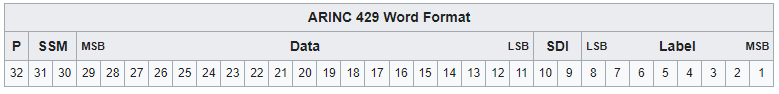

---
# ARINC-429 Protocol
Also known as Aeronautical Radio Inc., it is the predominant avionics data bus.
It defines the physical and electrical interfaces.

## ARINC-429 features:
- 2-wire data bus (separate ports for Tx and Rx)
- For bi-directional transmission, two 2-wire pairs are required
- Transmits either 32-bit words or NULL state
- 1 pair is limited to 1 transmitter and up to 20 receivers
- protocol allows for self-clocking at the receiver end; eliminates the need to transmit clocking data
    - This is really good for eliminating single-bit errors in error checking
- Data is transmitted in Return-to-Zero format (HIGH, NULL, LOW) ~ (+10V, 0V, -10V)

## ARINC-429 Word Format:
*** encoding for each section
*** BCD

32-bit Word `[31, 0]`

`[31]` = Parity bit
- For error detection

`[30, 29]` = SSM (Sign Status Matrix)
- Used to indicate sign or direction, and also to test if data is valid

`[28, 10]` = Data
- `[28]` = MSB
- `[10]` = LSB

`[9, 8]` = SDI (Source Destination Identifiers)
- Used by the transmitter to identify which receiver should process the message
- If not needed, may be used for data

`[7, 0]` = Label 
- Describes the data packet e.g. barometric data

## Implementation
Some guidelines for implementing an ARINC-429 communication channel.

For SPI enabled microcontrollers, an IC is required to interface the microcontroller to the ARINC-429 bus.

See [https://pdf1.alldatasheet.com/datasheet-pdf/view/441826/HOLTIC/HI-3593.html] for an example of an SPI-to-ARINC-429 interface driver.

### Initialization
- Initialize your SPI controller to communicate with the ARINC-429 interfacing IC.
- Configure the Transmitter Control Register (TCR)
- Configure the Receiver Control Registers (RX1CR,...)
- Configure the Interrupt Control Registers

### Self-Check
### Execution